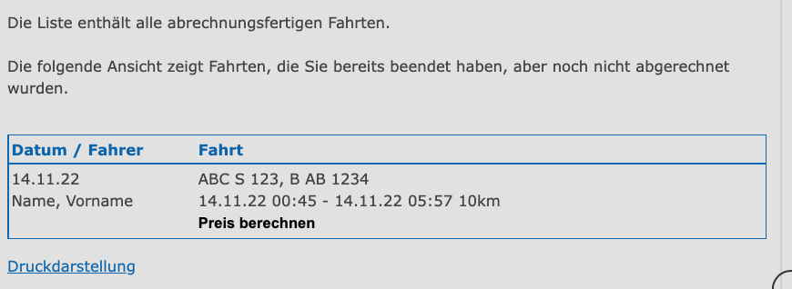
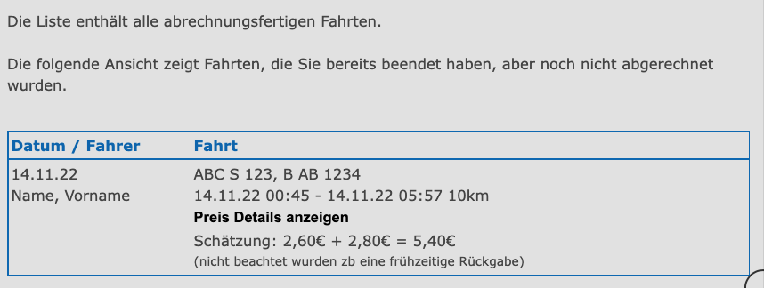
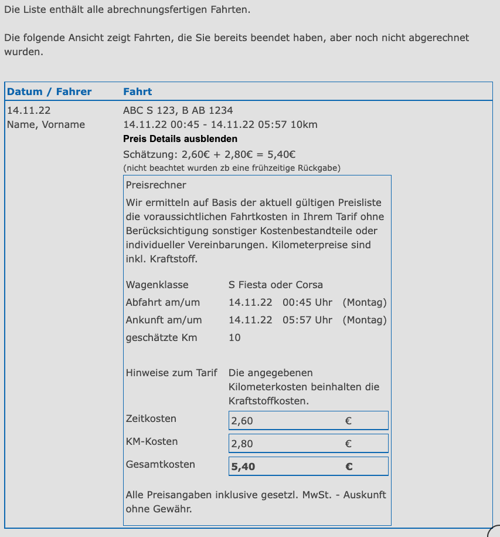

## Overview

it adds the button to show prices:

after clicking you see the estimated prices:

you can also see the full price info (server response of the calculation):

## Installation

open this link and tampermonkey will show an option to install the script:

https://github.com/muescha/cambiocar-userscript/raw/master/cambiocar-userscipt.user.js